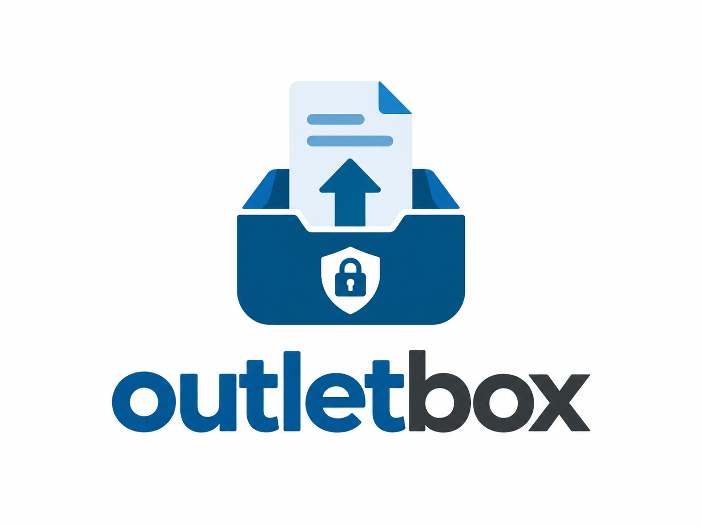

<p align="center">
  
</p>

<p align="center">
  <b>A private, self-hosted delivery box.</b><br>
  Send files to clients. A forwarded link alone opens nothing.
</p>

<p align="center">
  <a href="https://github.com/pan-dolina/outletbox/releases"></a>
  <a href="LICENSE"></a>
  
</p>

---

You put files and notes in a case and create a link for one or more recipients. To open
the link, a recipient types **their own e-mail address**, which must be one the link was
created for, and then a **one-time code sent to that address**. After that they can read
the notes and download the files. The number of openings can be capped, and every step is
logged.

outletbox is not a file-sharing service or a network drive. There are no public links, no
previews and no self-registration. Its sister project
[inletbox](https://github.com/pan-dolina/inletbox) does the opposite job: it collects files
**from** clients.

```
admin:      case → files + notes → link for anna@example.com → hands over the URL
recipient:  opens URL → types own address → receives 6-digit code by e-mail → downloads
```

## Why outletbox

- **A leaked link is not a leak.** Opening a delivery needs the link, an address it was
  issued for and access to that mailbox. A forwarded or intercepted URL opens nothing.
- **The page never says who a delivery is for.** A wrong address gets the same page as a
  correct one and no code is sent, so nobody can probe a link to find out who it was
  meant for.
- **The link never travels by e-mail.** The application e-mails only the code. You pass
  the link on yourself, so one intercepted message is never enough.
- **One link, many people.** Everyone on the list unlocks the same URL with their own
  address and code. Add or remove people later; the URL stays the same.
- **Recipients need nothing installed.** No account and no app: a browser and their
  mailbox are enough. Each recipient sees the pages and the e-mail in their own language.
- **You run it.** One container and one volume. Files stay on your disk or in your own
  S3/MinIO bucket, and mail goes through your own SMTP relay, Microsoft 365 or Amazon SES.

## Features

| | |
|---|---|
| **Deliveries** | Files and notes per case; links with expiry, an opening cap, revocation and rotation; closing a case ends open sessions immediately |
| **Recipients** | E-mail address + one-time code tied to the browser that requested it; per-recipient language; reusable address groups |
| **Mail** | SMTP (STARTTLS / TLS), Microsoft 365 via Graph (app-only OAuth), Amazon SES v2, or a `log` driver that sends nothing (the default) |
| **Uploads** | Resumable uploads from the panel ([tus](https://tus.io)) for large files, plus a streaming upload API for scripts |
| **Accounts** | `admin` and `user` roles, users assigned per case, generated temporary passwords, TOTP second factor with recovery codes |
| **Storage** | Local disk or any S3-compatible bucket; automatic database backup before every migration |
| **Audit** | Logins, links, codes sent, openings and downloads, recorded with the client IP; never a token or a code |
| **Interface** | All 24 official EU languages, light and dark theme, your own name, logo and colours, also in the code e-mail |
| **Footprint** | Node.js + SQLite, no native modules, no external database |

## Quick start

```bash
git clone https://github.com/pan-dolina/outletbox.git && cd outletbox
cp .env.example .env              # set PUBLIC_URL and MAIL_* (MAIL_DRIVER=log sends nothing)
docker compose up -d --build
docker compose exec app node dist/cli.js create-admin admin
docker compose exec app node dist/cli.js test-mail you@example.com
```

Open `PUBLIC_URL/admin`, sign in and turn on two-factor authentication under
**Security**. The app listens on `127.0.0.1:3000`; put a reverse proxy in front of it for
TLS. The settings are in [docs/reverse-proxy.md](docs/reverse-proxy.md), and setting up
each mail driver is covered in [docs/mail.md](docs/mail.md).

To upgrade, check out the new tag and run `docker compose up -d --build` again. The
database is backed up automatically before any migration runs.

## Documentation

| | |
|---|---|
| [Installation](docs/installation.md) | Docker Compose, CLI, upgrading and rolling back, local development |
| [How a delivery works](docs/delivery.md) | The recipient flow, and why each step works the way it does |
| [Configuration](docs/configuration.md) | Every environment variable, branding |
| [Sending mail](docs/mail.md) | SMTP, Microsoft 365, Amazon SES, how the logo travels |
| [Reverse proxy](docs/reverse-proxy.md) | nginx and Caddy for large uploads, keeping tokens out of logs, Cloudflare |
| [Permissions and security](docs/security-model.md) | Who can do what, and how each guarantee is enforced |
| [Architecture](docs/architecture.md) | Source layout, data model, storage and uploads, known limitations |
| [Tests and scanning](docs/testing.md) | Test suite, coverage, CI security checks |

## Project

- [CHANGELOG.md](CHANGELOG.md): what changed in each release.
- [CONTRIBUTING.md](CONTRIBUTING.md): how to work on outletbox, and the things that look
  like bugs but are not.
- [SECURITY.md](SECURITY.md): how to report a vulnerability. **Please don't use a public
  issue;** use
  [private reporting](https://github.com/pan-dolina/outletbox/security/advisories/new).
- [CODE_OF_CONDUCT.md](CODE_OF_CONDUCT.md)

Only the English and Polish translations have been checked by people who read those
languages. The other 22 have not been reviewed by native speakers, and corrections are
welcome.

## License

Apache License 2.0, see [LICENSE](LICENSE).
